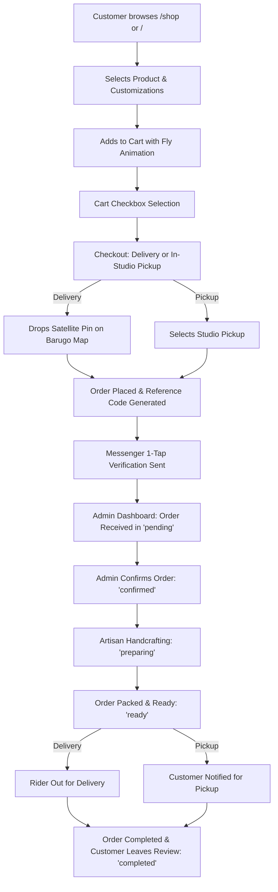
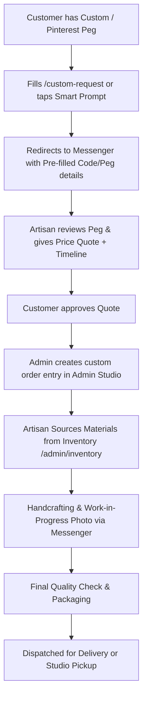
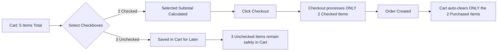
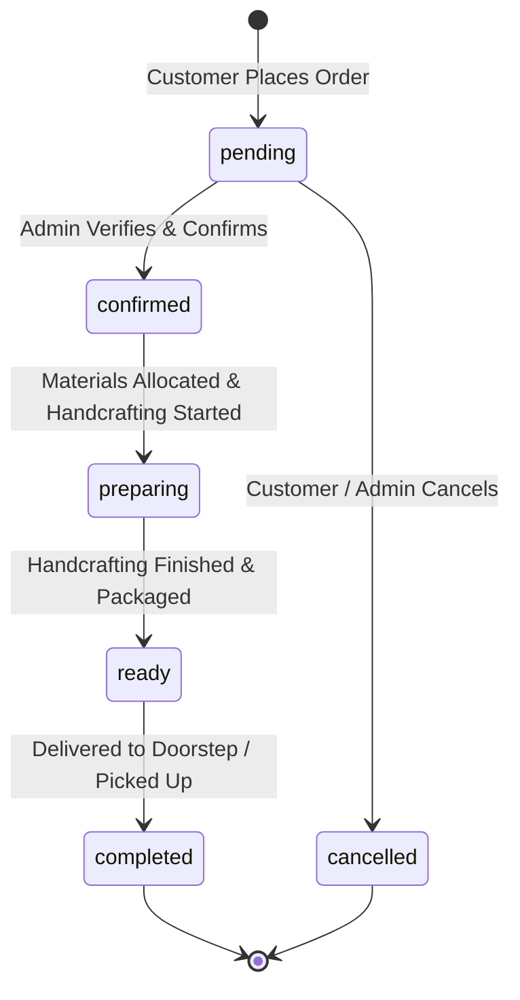

# 🌸 LIKHA — M&M Artsy Platform Documentation 2.0

> **LIKHA** is a modern, mobile-first eCommerce & artisan studio management platform built for **M&M Artsy** — specializing in handcrafted everlasting fuzzy wire bouquets, crochet art, resin keepsakes, and personalized gift boxes.

---

## 📑 Table of Contents
1. [Tech Stack & Architecture](#-tech-stack--architecture)
2. [Customer Storefront Experience](#-customer-storefront-experience)
   - [Home & Curated Showcase (`/`)](#1-home--curated-showcase-)
   - [Collection & Progressive Catalog (`/shop`)](#2-collection--progressive-catalog-shop)
   - [Product Details & Live Configurator (`/shop/[slug]`)](#3-product-details--live-configurator-shopslug)
   - [Shopee-Style Cart (`/cart`)](#4-shopee-style-cart-cart)
   - [Checkout & High-Res Satellite Map (`/checkout`)](#5-checkout--high-res-satellite-map-checkout)
   - [Order Confirmation (`/confirmation/[referenceCode]`)](#6-order-confirmation-confirmationreferencecode)
   - [Order Tracking Hub (`/track`)](#7-order-tracking-hub-track)
   - [Bespoke Custom Requests (`/custom-request`)](#8-bespoke-custom-requests-custom-request)
3. [Messenger Integration & Pre-Filled Templates](#-messenger-integration--pre-filled-templates)
5. [End-to-End Workflows & Lifecycle Diagrams](#-end-to-end-workflows--lifecycle-diagrams)
   - [Standard Order Fulfillment Lifecycle](#1-standard-order-fulfillment-lifecycle)
   - [Bespoke Custom Crafting Workflow](#2-bespoke-custom-crafting-workflow)
   - [Cart Selective Checkout & Isolation Workflow](#3-cart-selective-checkout--isolation-workflow)
   - [Order Tracking State Machine](#4-order-tracking-state-machine)
6. [Key Design & UX Architectural Improvements](#-key-design--ux-architectural-improvements)
7. [Data Models & Schema Reference](#-data-models--schema-reference)

---

## 🛠️ Tech Stack & Architecture

- **Framework**: [Next.js (App Router)](https://nextjs.org/) — Server Components, Client Components, Server Actions & API Routes.
- **Language**: Modern JavaScript (ES2024+ / React 19).
- **Styling**: Vanilla CSS Design System (`mobile-app.css`, `globals.css`) — Tokenized variables, fluid typography, dark/light contrast, touch-optimized PWA layout.
- **Database & Storage**: [Supabase](https://supabase.com/) (PostgreSQL) with local mock fallback layer (`mockData.js`) for uninterrupted offline demo & prototyping.
- **Mapping Engine**: [Leaflet](https://leafletjs.com/) with High-DPI **Google Earth Satellite / Hybrid Imagery** (Retina tiles, road labels, zero watermark).
- **Icons**: FontAwesome 6 Pro CDN + Google Fonts (Fredoka, Outfit, Inter).

---

## 🛍️ Customer Storefront Experience

### 1. Home & Curated Showcase (`/`)
- **Showcase Tabs**: Quick toggle between **Bestsellers**, **On-Hand** (Ready-made in stock), and **Promos / Sale**.
- **Interactive Header**: Branded gradient logo, expanded modal search bar, and cart badge with live quantity bounce animation.
- **Smart Custom Prompts**: Relatable Taglish prompt cards (e.g., *“May Pinterest peg ka?”*, *“Flower na hindi nalalanta?”*) linked directly to Messenger with tailored templates.

### 2. Collection & Progressive Catalog (`/shop`)
- **Category Filter Tabs**: Bouquets & Flowers, Crochet Art, Resin Keepsakes, Bloom Boxes, and Ready-Made.
- **Progressive Batch Loading**: Loads 10 products per batch with an animated progress bar (*“Showing 10 of 24 products • 42%”*) and **`Load More (+10)`** pill button.
- **Clean Empty State**: When 0 items match, displays a neat rounded icon, friendly explanation, and two 1-tap action pills: **`[ View All Products ]`** and **`[ Custom Order ]`**.

### 3. Product Details & Live Configurator (`/shop/[slug]`)
- **Punch-Hole Camera Safe Top Bar**: Back navigation button with left-aligned title (`[←] Product Details`) preventing overlap with phone camera cutouts and dynamic islands.
- **Photo Carousel**: Touch-swipe enabled with chevron navigation and dot indicators.
- **Tight, Snug Spacing**: Zero dead whitespace between product title, pricing, description, and the quantity card.
- **Parabolic Fly-to-Cart Animation**: Adding an item triggers a floating particle thumbnail arcing directly into the header cart icon with badge pop.
- **Shopee-Style Action Bar**:
  - `[ 🛒 Add to Cart ]` + `[ Buy Now · ₱XXX.XX ]`
  - When Sold Out: Displays disabled state with **`[ 💬 Inquire Restock on Messenger ]`**.
- **Interactive Customer Reviews**:
  - Overall rating score summary with star breakdown.
  - Review pagination: **3 reviews per page** with **`Prev` / `Next`** and interactive page indicator pills.
  - Modal form for submitting verified feedback with instant preview.

### 4. Shopee-Style Cart (`/cart`)
- **Item Selection Checkboxes**: Shopee-style checkboxes allowing customers to select specific items for checkout while leaving unselected items saved for later.
- **Master "Select All" Bar**: 1-tap bulk select/deselect with count and live selected total calculation.
- **Single-Line Text Truncation**: Product titles and options strictly truncate with `...` (`text-overflow: ellipsis`) preventing ugly multi-line text wrapping.
- **Stacking-Safe 3-Dots Menu**: Active dropdowns elevate to `z-index: 50` ensuring options editing and deletion menus never overlap or show underlying buttons.
- **Accidental Deletion Protection**:
  - Individual item delete confirmation modal.
  - Bulk batch delete confirmation modal for selected items.
- **Smart Order Summary**: Snug summary card showing selected subtotal, delivery notes, and instant checkout button.

### 5. Checkout & High-Res Satellite Map (`/checkout`)
- **Selective Checkout**: Only checks out and clears selected cart items; unselected items remain in the cart.
- **Fulfillment Toggle**: Door-to-Door Delivery vs In-Studio Store Pickup.
- **Google Earth Satellite Hybrid Map**:
  - **Default Location**: Automatically centers on **Barugo Town Proper (Poblacion, Leyte — `11.3256, 124.7349`)** at Zoom 17.
  - **High-DPI Satellite View**: Crystal-clear Google satellite photography with street outlines and barangay labels.
  - **Zero Watermarks**: Leaflet attribution controls completely hidden (`attributionControl: false` + CSS display none).
  - **Draggable Orange Pin**: Customers can click anywhere or drag the pin directly over their roof.
  - **Auto Reverse Geocoding**: Automatically updates the address/landmark text field upon dropping the pin.
- **Bulletproof Geolocation ("Use My Location")**:
  - Smooth GPS detection with high-accuracy fallback.
  - **Zero Long Error Banners**: No distracting red warning paragraphs. If GPS is off, displays a clean 1-word status: **`Unavailable`** on the button.

### 6. Order Confirmation (`/confirmation/[referenceCode]`)
- **Unique Reference Code**: Generated with prefix `LK-YYMMDD-XXX` or `M&M-YYMMDD-XXX`.
- **Order Summary**: Complete breakdown of customer details, delivery location, items, and payment mode.
- **Direct Messenger Verification**: 1-tap **`Send Confirmation to Messenger`** button with complete pre-filled order breakdown.

### 7. Order Tracking Hub (`/track`)
- **Instant Search**: Search by reference code with clean input bar (no distracting demo chips).
- **Visual Progress Timeline**:
  1. *Order Submitted* 📝
  2. *Confirmed & Scheduled* 📋
  3. *Crafting / In Production* 🧶✨
  4. *Ready for Pickup / Out for Delivery* 🚚
  5. *Delivered / Completed* 🎉
- **Order History Grouping**: Grouped into **Active Orders** and **Completed Orders** with progressive pagination (**`Show More Orders (+X)` / `Show Less`**).
- **Messenger Quick Action Templates**: Instant 1-tap template chips for following up status, asking for delivery ETA, or updating delivery notes.

### 8. Bespoke Custom Requests (`/custom-request`)
- Dedicated form for customers wanting custom colorways, sizes, floral arrangements, or resin designs with reference photo attachments.
- Instant pre-filled Messenger connection upon submission.

---

## 💬 Messenger Integration & Pre-Filled Templates

Every Messenger link across LIKHA features automated pre-filled message templates encoded with URL parameters (`https://m.me/61587268312750?text=...`):

| Page & Touchpoint | Pre-Filled Template Content |
| :--- | :--- |
| **Sold Out Inquire** (`/shop/[slug]`) | `Hi M&M Artsy! Inquire ko lang po kung kailan magkaka-stock ulit ng [Product Name]?` |
| **Order Confirmation** (`/confirmation/[code]`) | `Hi M&M Artsy! I would like to confirm my order [Reference Code] for [Customer Name]... (Full breakdown)` |
| **Track Order: Follow Up** (`/track`) | `Hi M&M Artsy! Following up on my order: [Reference Code]. May update na po ba?` |
| **Track Order: Delivery Time** (`/track`) | `Hi M&M Artsy! Anong oras po estimated delivery ng order kong [Reference Code]?` |
| **Track Order: Address Update** (`/track`) | `Hi M&M Artsy! Pwede po mag-update ng delivery details para sa [Reference Code]?` |
| **Custom Order Submission** (`/custom-request`) | `Hi! I submitted a custom request with reference: [Reference Code]` |
| **Home/Shop Custom Prompts** (`/` & `/shop`) | Dynamic Taglish prompt text (e.g. `Hi M&M Artsy! May Pinterest/custom peg po akong gusto ipagawa sa inyo.`) |
| **Floating Support Menu** | `Hi M&M Artsy! I have an inquiry/question regarding your shop.` |

---

## 🔄 End-to-End Workflows & Lifecycle Diagrams

### 1. Standard Order Fulfillment Lifecycle

The complete path of an order from customer catalog browsing to doorstep delivery or studio pickup:



#### Step-by-Step Breakdown:
1. **Discovery & Customization**: Customer explores handcrafted items on the catalog or home showcase.
2. **Cart Staging**: Product is added to the cart with parabolic animation. Customer can check/uncheck items for selective checkout.
3. **Checkout & Geolocation**: Customer selects delivery method. If delivery is chosen, they can pinpoint their exact house on the high-DPI Google Satellite Hybrid map centered on Barugo, Leyte.
4. **Instant Reference Code & Messenger Sync**: A unique reference code (`LK-YYMMDD-XXX`) is created, and the customer can tap to verify directly on Messenger with the full order breakdown.
5. **Admin Operations**: Admin reviews the order in `/admin/orders`, inspects pinned coordinates, accepts the order (`confirmed`), updates progress as items are handcrafted (`preparing`), marks ready (`ready`), and finalizes fulfillment (`completed`).

---

### 2. Bespoke Custom Crafting Workflow

For custom floral arrangements, Pinterest pegs, personalized resin crafts, or unique crochet art:



---

### 3. Cart Selective Checkout & Isolation Workflow

Enables customers to maintain a wishlist/staging area in their cart while checking out only chosen items:



---

### 4. Order Tracking State Machine

Database status field transitions mapped to customer-facing tracking timeline:



---

## 💎 Key Design & UX Architectural Improvements

1. **Camera Notch & Punch-Hole Immunity**:
   - Standardized top bar headers to left-align title text (`[←] Title`) preventing physical camera cutout collisions on modern smartphones.
2. **Accurate & Consistent eCommerce Terminology**:
   - Standardized labels (*`Load More`*, *`Showing X of Y products`*, *`All X products loaded`*, *`No products in this category yet`*).
3. **Optimized Screen Real Estate**:
   - Removed excessive vertical gaps between gallery, description, quantity control, and action buttons.
4. **Resilient Geolocation Handling**:
   - GPS errors handled silently with a 1-word `Unavailable` button label rather than long intrusive red error banners.
5. **Zero-Clutter Mock Data**:
   - Removed non-essential option chips and demo badges across the customer storefront for a streamlined purchasing journey.

---

## 🗄️ Data Models & Schema Reference

### `products`
```sql
CREATE TABLE products (
  id UUID PRIMARY KEY DEFAULT gen_random_uuid(),
  name TEXT NOT NULL,
  slug TEXT UNIQUE NOT NULL,
  description TEXT,
  base_price NUMERIC(10, 2) NOT NULL,
  category_id UUID REFERENCES categories(id),
  is_available BOOLEAN DEFAULT TRUE,
  is_bestseller BOOLEAN DEFAULT FALSE,
  is_ready_made BOOLEAN DEFAULT FALSE,
  ready_made_stock INTEGER DEFAULT 0,
  is_on_sale BOOLEAN DEFAULT FALSE,
  sale_price NUMERIC(10, 2),
  is_sold_out BOOLEAN DEFAULT FALSE,
  created_at TIMESTAMPTZ DEFAULT NOW()
);
```

### `orders`
```sql
CREATE TABLE orders (
  id UUID PRIMARY KEY DEFAULT gen_random_uuid(),
  reference_code TEXT UNIQUE NOT NULL,
  customer_name TEXT NOT NULL,
  customer_phone TEXT NOT NULL,
  order_type TEXT NOT NULL CHECK (order_type IN ('delivery', 'pickup')),
  total_amount NUMERIC(10, 2) NOT NULL,
  status TEXT DEFAULT 'pending' CHECK (status IN ('pending', 'confirmed', 'preparing', 'ready', 'completed', 'cancelled')),
  payment_method TEXT DEFAULT 'cod',
  notes TEXT,
  created_at TIMESTAMPTZ DEFAULT NOW()
);
```

### `delivery_locations`
```sql
CREATE TABLE delivery_locations (
  id UUID PRIMARY KEY DEFAULT gen_random_uuid(),
  order_id UUID REFERENCES orders(id) ON DELETE CASCADE,
  latitude DOUBLE PRECISION NOT NULL,
  longitude DOUBLE PRECISION NOT NULL,
  address TEXT,
  landmark_notes TEXT,
  created_at TIMESTAMPTZ DEFAULT NOW()
);
```

---

*Generated for LIKHA — M&M Artsy Platform 2.0*
